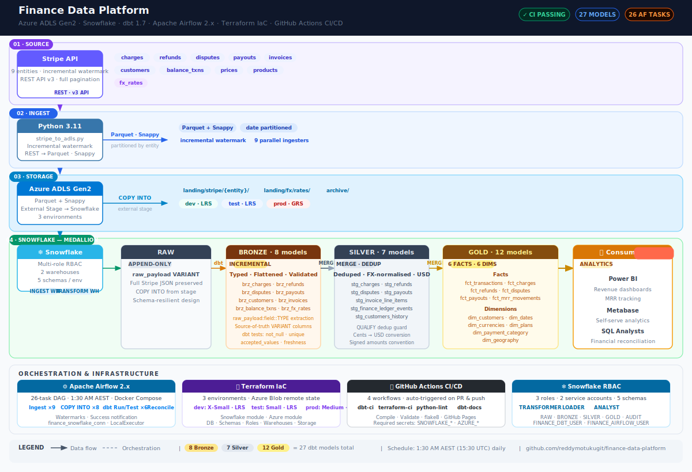

# Finance Data Platform

[](https://github.com/reddymotukugit/finance-data-platform/actions/workflows/dbt-ci.yml)
[](https://reddymotukugit.github.io/finance-data-platform/)
[](https://github.com/reddymotukugit/finance-data-platform/actions/workflows/terraform-ci.yml)
[](https://github.com/reddymotukugit/finance-data-platform/actions/workflows/python-lint.yml)

A **production-grade financial data pipeline** built on Azure ADLS Gen2 · Snowflake · dbt · Apache Airflow.

Ingests 9 Stripe financial entities daily, transforms them through a **Bronze → Silver → Gold medallion architecture**, and delivers clean, analytics-ready fact and dimension tables for revenue reporting, MRR tracking, and financial reconciliation.

---

## At a Glance

| | |
|---|---|
| **Stripe entities ingested** | 9 — charges, refunds, disputes, payouts, invoices, customers, balance transactions, prices, products |
| **dbt models** | 27 — 8 Bronze · 7 Silver · 12 Gold |
| **Airflow tasks** | 26 per daily run |
| **Pipeline schedule** | 1:30 AM AEST (15:30 UTC) |
| **Environments** | dev · test · prod (Terraform IaC, Azure remote state) |
| **CI/CD workflows** | 4 GitHub Actions workflows |

---

## Architecture



---

## Tech Stack

| Layer | Technology | Detail |
|---|---|---|
| **Source** | Stripe API | 9 entities, incremental watermark ingestion |
| **Ingestion** | Python 3.11 | `stripe_to_adls.py` — REST → Parquet → ADLS |
| **Storage** | Azure ADLS Gen2 | Parquet + Snappy, partitioned by entity |
| **Warehouse** | Snowflake | Multi-role RBAC, separate ingest / transform warehouses |
| **Transformation** | dbt 1.7 | Incremental models, surrogate keys, FX normalisation |
| **Orchestration** | Apache Airflow 2.x | Docker Compose, LocalExecutor, 26-task DAG |
| **IaC** | Terraform | dev / test / prod environments, Azure remote state |
| **CI/CD** | GitHub Actions | 4 workflows — lint, test, validate, publish docs |
| **Language** | Python 3.11, SQL, HCL | |

---

## dbt Models

### Bronze — 8 models · Raw typed views over RAW schema

| Model | Stripe Entity |
|---|---|
| `brz_stripe_charges` | Charges |
| `brz_stripe_refunds` | Refunds |
| `brz_stripe_disputes` | Disputes |
| `brz_stripe_payouts` | Payouts |
| `brz_stripe_customers` | Customers |
| `brz_stripe_invoice_line_items` | Invoice line items |
| `brz_stripe_balance_transactions` | Balance transactions |
| `brz_fx_rates` | FX rates (USD base) |

### Silver — 7 models · Cleaned, deduped, FX-normalised

| Model | Grain | Key transformations |
|---|---|---|
| `stg_charges` | 1 row per charge | Cents→USD, FX join, dedup, status normalisation |
| `stg_refunds` | 1 row per refund | Cents→USD, FX join, signed amounts |
| `stg_disputes` | 1 row per dispute | Status normalisation, signed amounts |
| `stg_payouts` | 1 row per payout | Arrival date, bank reconciliation ready |
| `stg_invoice_line_items` | 1 row per line item | MRR normalisation (annual→monthly) |
| `stg_finance_ledger_events` | 1 row per ledger event | Full ledger with sign convention |
| `stg_customers_history` | 1 row per customer | SCD-style latest snapshot |

### Gold — 12 models · 6 Facts + 6 Dimensions

| Model | Type | Grain | Description |
|---|---|---|---|
| `fct_transactions` | Fact | Per transaction | Full ledger with customer + date dims |
| `fct_charges` | Fact | Per charge | Revenue with payment method breakdown |
| `fct_refunds` | Fact | Per refund | Refund analysis with reason |
| `fct_disputes` | Fact | Per dispute | Dispute tracking and outcomes |
| `fct_payouts` | Fact | Per payout | Bank payout reconciliation |
| `fct_mrr_movements` | Fact | Per customer/month | MRR — New · Expansion · Contraction · Churn |
| `dim_customers` | Dimension | Per customer | Current customer attributes |
| `dim_dates` | Dimension | Per calendar day | Date spine 2018–2031 |
| `dim_currencies` | Dimension | Per currency | FX rates and currency metadata |
| `dim_plans` | Dimension | Per plan | Subscription plan attributes |
| `dim_payment_category` | Dimension | Per category | Payment method categories |
| `dim_geography` | Dimension | Per region | Geographic mapping |

---

## Airflow DAG — `finance_data_platform_daily`

26 tasks · runs daily at **1:30 AM AEST** (15:30 UTC)

```
create_run_id
    │
    ├── ingest_charges              ──► copy_into_raw_charges               ──┐
    ├── ingest_refunds              ──► copy_into_raw_refunds                ──┤
    ├── ingest_disputes             ──► copy_into_raw_disputes               ──┤
    ├── ingest_payouts              ──► copy_into_raw_payouts                ──┤──► dbt_run_bronze
    ├── ingest_customers            ──► copy_into_raw_customers              ──┤         │
    ├── ingest_invoices             ──► copy_into_raw_invoices               ──┤    dbt_test_bronze
    ├── ingest_invoice_line_items   ──► copy_into_raw_invoice_line_items     ──┤         │
    ├── ingest_balance_transactions ──► copy_into_raw_balance_transactions   ──┘    dbt_run_silver
    └── ingest_fx_rates                                                                  │
                                                                                   dbt_test_silver
                                                                                         │
                                                                                    dbt_run_gold
                                                                                         │
                                                                                   dbt_test_gold
                                                                                         │
                                                                          finance_reconciliation_checks
                                                                                         │
                                                                                 update_watermarks
                                                                                         │
                                                                            send_success_notification
```

---

## Terraform — Infrastructure as Code

Three environments managed with Terraform, state stored remotely in Azure Blob Storage.

| Environment | Snowflake Warehouse | Storage Replication | Auto-suspend |
|---|---|---|---|
| `dev` | X-SMALL | LRS | 60s |
| `test` | SMALL | LRS | 120s |
| `prod` | MEDIUM | GRS | 300s |

Resources provisioned per environment: Snowflake database, 5 schemas (RAW / BRONZE / SILVER / GOLD / AUDIT), 2 warehouses, 3 roles, 2 service accounts, Azure resource group, ADLS Gen2 storage account, blob container, and full landing zone folder structure.

```bash
# Plan any environment safely (no changes applied)
cd terraform/environments/dev
terraform init -reconfigure
terraform plan -var-file=terraform.tfvars
```

Remote state: `stterraformreddy001 / tfstate / finance-platform/{env}/terraform.tfstate`

---

## CI/CD

| Workflow | Trigger | What it does |
|---|---|---|
| `dbt-ci.yml` | PR touching `dbt/` | Compiles and runs all dbt models + tests against Snowflake dev |
| `terraform-ci.yml` | PR or push to `main` | `terraform fmt` check + `terraform validate` across all 3 environments |
| `python-lint.yml` | PR touching `scripts/` or `airflow/` | `flake8` — catches syntax errors and undefined names |
| `dbt-docs.yml` | Push to `main` | Generates dbt docs and publishes to GitHub Pages |

Required GitHub Secrets: `SNOWFLAKE_ACCOUNT` · `SNOWFLAKE_USER` · `SNOWFLAKE_PASSWORD` · `SNOWFLAKE_ROLE` · `SNOWFLAKE_WAREHOUSE` · `SNOWFLAKE_DATABASE`

**[📖 Live dbt Docs →](https://reddymotukugit.github.io/finance-data-platform/)**

---

## Project Structure

```
finance-data-platform/
├── .github/workflows/
│   ├── dbt-ci.yml                       # dbt compile + run + test on PR
│   ├── dbt-docs.yml                     # Publish dbt docs to GitHub Pages
│   ├── terraform-ci.yml                 # fmt + validate on PR, plan/apply on dispatch
│   └── python-lint.yml                  # flake8 on ingestion + DAG files
├── airflow/
│   ├── dags/finance_daily_dag.py        # 26-task production DAG
│   ├── Dockerfile
│   ├── docker-compose.yml
│   └── requirements.txt
├── dbt/
│   ├── models/
│   │   ├── bronze/                      # 8 models — typed views over RAW
│   │   ├── silver/                      # 7 models — cleaned, deduped, FX-normalised
│   │   └── gold/                        # 12 models — 6 facts + 6 dimensions
│   ├── macros/generate_schema_name.sql  # Ensures BRONZE/SILVER/GOLD schema naming
│   ├── profiles.yml.example
│   └── dbt_project.yml
├── scripts/
│   └── stripe_to_adls.py               # Stripe → ADLS Gen2 — 9 entities, incremental
├── setup/
│   ├── azure/setup_azure.sh
│   └── snowflake/                       # 5 SQL setup scripts (01 → 05)
├── terraform/
│   ├── environments/dev|test|prod/      # Per-environment config + tfvars
│   └── modules/snowflake|azure/         # Reusable Terraform modules
├── docs/DEPLOYMENT_GUIDE.md
├── .env.example
└── .gitignore
```

---

## Local Setup

### Prerequisites
- Docker Desktop, Python 3.11+, Snowflake account, Azure subscription, Stripe account

### Steps

```bash
# 1. Clone
git clone https://github.com/reddymotukugit/finance-data-platform.git
cd finance-data-platform

# 2. Environment variables
cp .env.example .env
# Edit .env with your credentials

# 3. Snowflake setup — run in your Snowflake worksheet in order:
# setup/snowflake/01_schemas_warehouses_roles.sql
# setup/snowflake/02_raw_tables.sql
# setup/snowflake/03_audit_tables.sql
# setup/snowflake/04_storage_integration.sql
# setup/snowflake/05_create_stages.sql

# 4. Azure storage
chmod +x setup/azure/setup_azure.sh && ./setup/azure/setup_azure.sh

# 5. dbt profile
cd dbt && cp profiles.yml.example profiles.yml
# Edit profiles.yml with your Snowflake credentials

# 6. Start Airflow
cd ../airflow && cp ../.env .env && docker compose up -d
# UI → http://localhost:8080  (admin / admin)
```

Add Snowflake connection in Airflow (Admin → Connections):
`Connection ID: snowflake_finance` · `Database: FINANCE_PLATFORM_DEV` · `Warehouse: FINANCE_TRANSFORM_WH` · `Role: FINANCE_TRANSFORMER`

Unpause `finance_data_platform_daily` and trigger a manual run — all 26 tasks should complete green in ~5–10 minutes.

---

## Key Design Decisions

**`raw_payload VARIANT` as source of truth** — Every RAW table stores the full Stripe JSON in a `raw_payload` VARIANT column. Bronze models extract fields using Snowflake's semi-structured access (`raw_payload:field::TYPE`), making the pipeline resilient to upstream schema changes.

**Incremental models with `unique_key`** — All Silver and Gold models use dbt's incremental MERGE strategy so daily runs only process new records, keeping Snowflake compute costs minimal.

**`QUALIFY` for deduplication** — COPY INTO can land duplicates if a file is staged more than once. All Silver models use `QUALIFY ROW_NUMBER() OVER (PARTITION BY id ORDER BY loaded_at DESC) = 1` as a guard before the MERGE.

**FX normalisation in Silver** — All monetary amounts are converted to USD in the Silver layer using a deduplicated FX rates table. Gold models stay simple and currency-agnostic.

**Signed amount convention** — Refunds, disputes, and adjustments are stored as negative amounts in `stg_finance_ledger_events`. Charges and payouts are positive. Makes aggregations in Gold straightforward.

**Sparse entity freshness** — Freshness checks are disabled (`freshness: null`) for prices and products (static reference data) and set to 72 h / 168 h for refunds and disputes (legitimately low-volume). Prevents false pipeline alerts.
